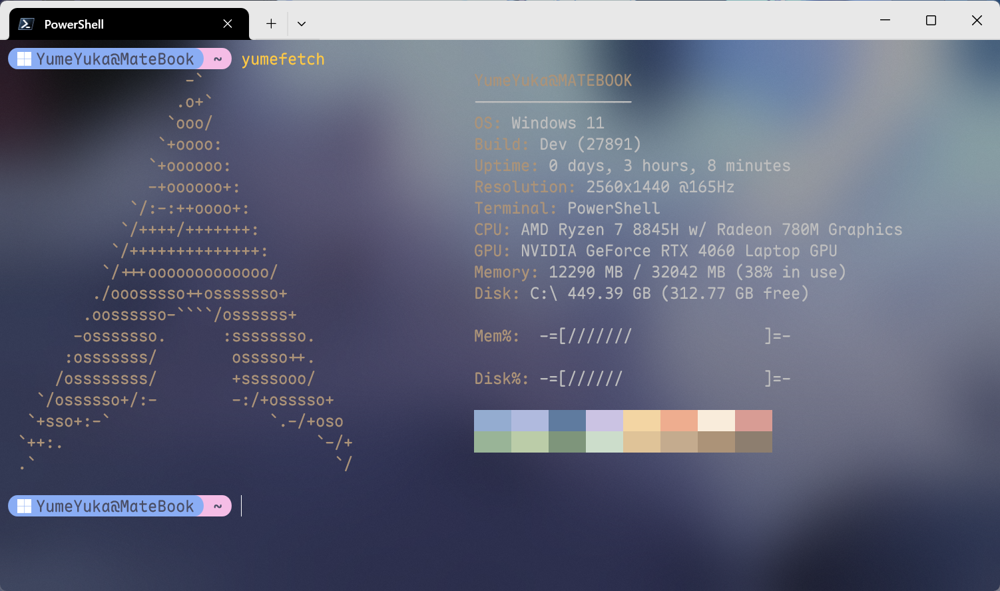

## Yume-neofetch
> neofetch for Windows  

This is a tool that can be used on Windows like linux neofetch
Just enter `yumefetch` in the terminal, of course you can change it to any command you like

### TODO
- [x] Set other logos
- [x] Random colors
- [ ] Support custom logo

> [!NOTE]
> Dig the pit first, then gugu

### use
Download the latest `exe` executable in Release, place it where you can find it, and add environment variables
Enter `yumefetch` in the terminal

You can use `yumefetch --set-logo <logo>` to set the displayed logo, for example, the logo I like `arch`

```ps
Yume-neofetch help:
  --set-logo <logo>    Set the displayed logo
  --list-logos         List all available logos
  --version            Show current version number
  --help, -h           Show help information
```
### Preview

 

### license
```
YumeYuka Starry Oath

Copyright (c) 2025 YumeYuka

Permission is hereby granted to anyone to freely copy, distribute, modify, merge, sell, publish, sublicense, or otherwise use this work, subject to the following conditions:

1.  All copies or substantial portions of this work must include the name "YumeYuka" as the original author.
2.  All risks and liabilities arising from the use of this work shall be borne solely by the user.

The author YumeYuka provides this work "AS IS", without warranty of any kind, express or implied, including but not limited to the warranties of merchantability, fitness for a particular purpose, and noninfringement. This work may function, or it may fail completely; no intermediate state exists.

            Terms and Conditions

0.  The author shall not be liable for any claim, damages, or other liability arising from the use of this work, whether in an action of contract, tort, or otherwise.

Beneath the starry sky, freedom is yours.
```