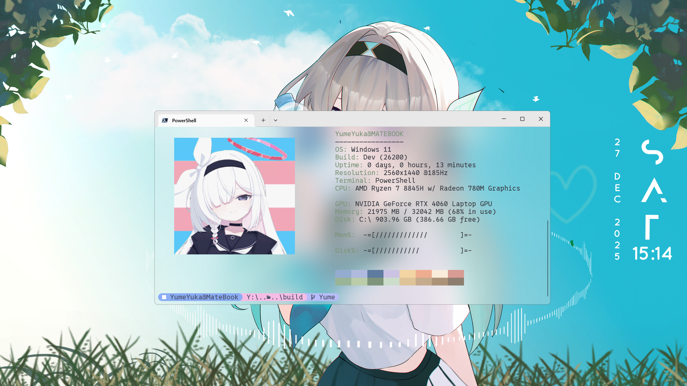

## YumeFetch

Windows system info display tool (similar to neofetch)

## Usage

```bash
YumeFetch                    # Auto mode - reads image from config.yaml
YumeFetch --image <path>      # Use custom image
YumeFetch --set-image <path>  # Set image path in config.yaml
YumeFetch --version           # Show version
YumeFetch --help, -h          # Show help
```

## Setup

1. Download `YumeFetch.exe` from Release
2. Add to PATH or place in desired directory
3. Run `YumeFetch` in terminal

## Config

Create `config.yaml` in same directory as exe:

```yaml
image_path: ./avatar
```

If no image is configured, falls back to ASCII art mode.

## Preview


